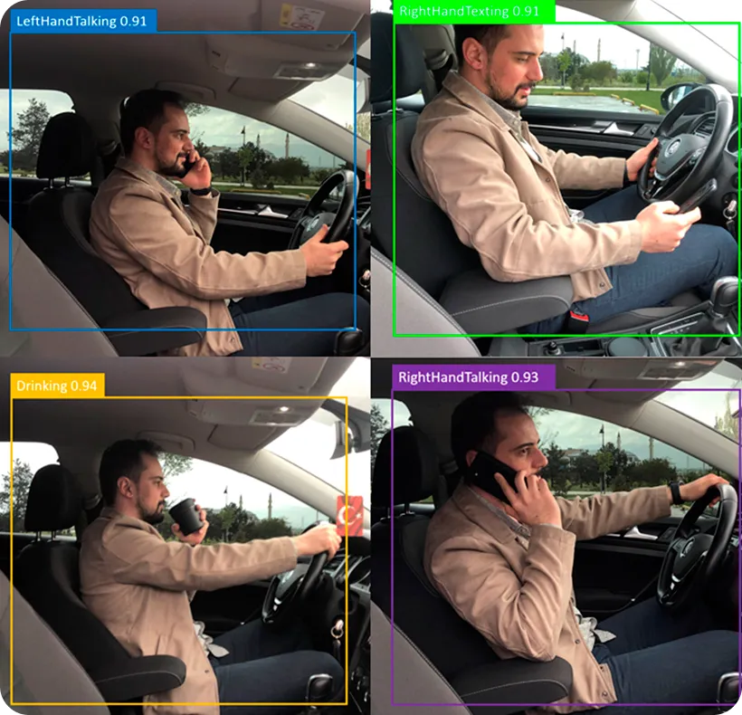

# AI-Driver-Awarness-System-
his project uses Artificial Intelligence (AI) and Computer Vision to monitor a driver’s behavior in real-time and detect signs of drowsiness or distraction. The system alerts the driver using alarms to prevent accidents and improve road safety.

🎯 Features
👀 Eye blink detection
😴 Drowsiness detection (closed eyes for long time)
📱 Distraction detection (looking away/mobile use)
🔔 Alarm alert system
🎥 Real-time webcam monitoring

Screenshots : - 
## 🚗 AI Driver Awareness System

